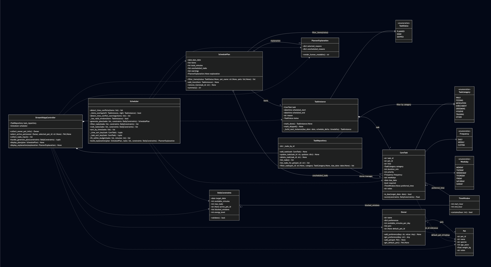

# PawPal+ Professional Manual

PawPal+ is a Streamlit-based pet care planner that helps owners build realistic daily care schedules from task priority, duration, recurrence, and pet-specific constraints.

## Overview

PawPal+ supports the full planning flow:

- Capture owner and pet information
- Create and store care tasks per pet
- Filter due tasks for the selected date/pet
- Rank and schedule tasks inside available time
- Surface conflicts and unscheduled items
- Explain why tasks were selected or not selected

## Features

The list below reflects the algorithms currently implemented in the codebase:

- Time-first deterministic sorting
	- Uses a stable sort that prefers explicit task time, then preferred time window start, then untimed tasks.
	- Tie-breakers include narrower time windows, required-before-optional, higher priority, shorter duration, title, and task ID.

- Constraint-aware due-task filtering
	- Filters tasks by active pet and due date.
	- Recurrence logic supports daily and weekday-based weekly/custom due checks.

- Greedy schedule fitting by minute budget
	- Selects ranked tasks in order while cumulative duration stays within available minutes.

- Sequential time block schedule generation
	- Converts selected tasks to concrete TaskInstance blocks starting at 08:00 on the target date.

- Conflict detection with overlap logic
	- Detects interval overlaps, including duplicate start times.
	- Returns warning messages instead of blocking plan generation.
	- Gracefully skips invalid time windows and reports them as warnings.

- Recurrence instance creation on completion
	- Marking a daily task done creates a new instance due next day.
	- Marking a weekly task done creates a new instance due next week.
	- New recurring instances receive a fresh task ID.

- Plan explanation generation
	- Records reasons for selected tasks.
	- Records unscheduled reasons such as insufficient time budget or lower effective rank.

- Fast in-memory task repository operations
	- Stores tasks by task ID for direct lookup and updates.
	- Keeps storage keys synchronized if task IDs change during updates.
	- Supports filter pipeline by pet, category, and due date.

## Project Structure

- `app.py`: Streamlit user interface and interactive planning workflow
- `pawpals_system.py`: Domain models, repository, scheduling, conflict detection, recurrence, and explanations
- `tests/test_pawpal.py`: Unit tests for sorting, recurrence, filtering, and conflict behavior
- `main.py`: Scripted sample run for console-based demonstration

## Setup

```bash
python -m venv .venv
source .venv/bin/activate  # Windows: .venv\Scripts\activate
pip install -r requirements.txt
```

## Run The App

```bash
streamlit run app.py
```

## Testing

Run automated tests:

```bash
python -m pytest
```

Current suite validates:

- Sorting by time and deterministic tie-breakers
- Daily and weekly recurrence behavior on task completion
- Conflict detection for overlapping and duplicate-time tasks
- Repository and filtering behavior across pet/category/date criteria

## 📸 Demo


